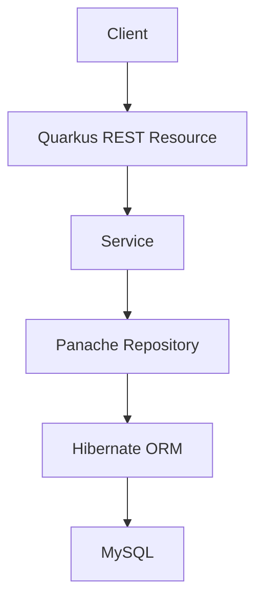

# Quiz API

## Overview

Quiz REST API built with Java 17 and Quarkus. It manages quiz sets and their questions through a small, layered backend.

## Features

- Quiz set CRUD and tag filtering
- Question CRUD with ordered options and a required quiz set
- Request validation and consistent JSON errors
- MySQL persistence with Flyway migrations
- OpenAPI and Swagger UI
- Automated Quarkus and RestAssured tests using H2
- Docker Compose setup

## Architecture



## Domain

`QuizSet` owns many `QuizQuestion` records. Each question has a prompt, ordered options, and an answer that must appear in the options. Deleting a quiz set deletes its questions.

## Tech Stack

Java 17, Quarkus 3.21, Jakarta REST, Hibernate ORM with Panache Repository, MySQL, H2 for automated tests, Bean Validation, RestAssured, Flyway, SmallRye OpenAPI, Docker.

## API

| Method | Path | Purpose |
| --- | --- | --- |
| GET, POST | `/quiz-sets` | List or create quiz sets |
| GET, PUT, DELETE | `/quiz-sets/{id}` | Read, update, or delete a quiz set |
| GET | `/quiz-sets/by-tag/{tag}` | Filter quiz sets by tag |
| POST | `/quiz-sets/questions` | Create a question |
| GET, PUT, DELETE | `/quiz-sets/questions/{id}` | Read, update, or delete a question |

Create a quiz set with `POST /quiz-sets`:

```json
{"title":"Geography","description":"Capital cities","tags":["geography"]}
```

Then create a question with `POST /quiz-sets/questions`:

```json
{
  "question": "What is the capital of Indonesia?",
  "options": ["Jakarta", "Bandung", "Surabaya"],
  "answer": "Jakarta",
  "quizSetId": 1
}
```

Successful POST requests return `201` and a `Location` header. Missing resources return `404` with a code such as `QUIZ_SET_NOT_FOUND`. Invalid requests return `400` with `VALIDATION_ERROR` and field errors.

## Setup

Requires Java 17 or newer, and either MySQL 8 or Docker Compose. The application uses **MySQL**; **H2 is used only by automated tests**.

For local development, start MySQL with `docker compose up -d mysql`, then run `./mvnw quarkus:dev` (Windows: `mvnw.cmd quarkus:dev`). The defaults in `application.properties` match the example Compose database. Configure the application through `DB_URL`, `DB_USER`, `DB_PASSWORD`, `CORS_ORIGINS`, and optionally `HTTP_PORT`. Compose uses `MYSQL_APP_USER`, `MYSQL_APP_PASSWORD`, and `MYSQL_ROOT_PASSWORD`. Set real secrets in the deployment environment; Compose defaults are local examples.

Flyway applies `V1__create_quiz_tables.sql` at startup. It expects an empty database on first use. Existing databases from the previous Hibernate `update` setup need a planned data migration before switching to this version; the old `options` JSON string column is replaced by a `QuizOption` table.

## Testing and Build

```bash
./mvnw test
./mvnw package
docker compose up --build
```

Tests run against in-memory H2 in MySQL compatibility mode and apply the same Flyway migration. The packaged JVM application is under `target/quarkus-app`.

## API Documentation

In development mode, Swagger UI is available at `http://localhost:8080/q/swagger-ui` and OpenAPI JSON at `http://localhost:8080/q/openapi`.
